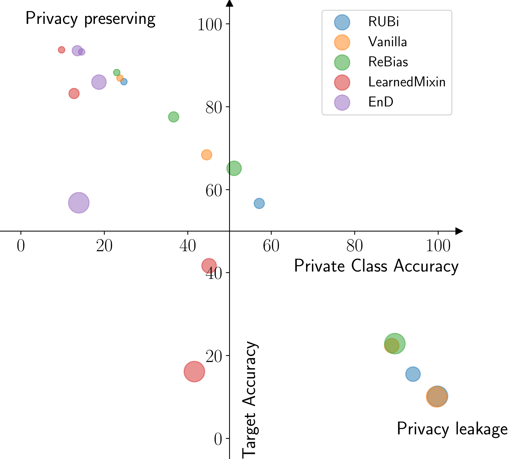

# Bridging the gap between debiasing and privacy for deep learning

Carlo Alberto Barbano1, Enzo Tartaglione1,2, Marco Grangetto1

1University of Turin, Computer Science dept. 
2Télécom Paris, Paris, France
 

The broad availability of computational resources and the recent scientific progresses made deep learning the elected class of algorithms to solve complex tasks.  
Besides their deployment, two problems have risen: fighting biases in data and privacy preservation of sensitive attributes. 
Many solutions have been proposed, some of which deepen their roots in the pre-deep learning theory.
There are many similarities between debiasing and privacy preserving approaches: how far apart are these two worlds, when the private information overlaps the bias?
In this work we investigate the possibility of deploying debiasing strategies also to prevent privacy leakage. In particular, empirically testing on state-of-the-art datasets, we observe that there exists a subset of debiasing approaches which are also suitable for privacy preservation. We identify as the discrimen the capability of effectively hiding the biased information, rather than simply re-weighting it.

 

### Downloading checkpoints

Download pretrained checkpoints from: https://datacloud.di.unito.it/index.php/s/EixML38N7jBaZKa

### Training

- For training models regularized with REBIAS, Learned Mixin, RUBi and Vanilla models on MNIST use [train.sh](https://github.com/EIDOSlab/bridging-debiasing-privacy-deep-learning/blob/master/train.sh), and refer to the [official REBIAS repository](https://github.com/clovaai/rebias)

- For training EnD regularized models on MNIST refer to the [EnD official repository](https://github.com/EIDOSlab/entangling-disentangling-bias)

- For training MNIST bias classifiers (attack) use [train_classifier.sh](https://github.com/EIDOSlab/bridging-debiasing-privacy-deep-learning/blob/master/train_classifier.sh)

- For training bias classifiers (attack) on CelebA and IMDB refer to [train_celeba.py](https://github.com/EIDOSlab/bridging-debiasing-privacy-deep-learning/blob/master/train_celeba.py) and [train_imdb.py](https://github.com/EIDOSlab/bridging-debiasing-privacy-deep-learning/blob/master/train_imdb.py) (you must download the pretrained Vanilla and EnD checkpoints). If you want to train these models by yourself, refer to the hyperparm search described in the [EnD paper](https://openaccess.thecvf.com/content/CVPR2021/html/Tartaglione_EnD_Entangling_and_Disentangling_Deep_Representations_for_Bias_Correction_CVPR_2021_paper.html)